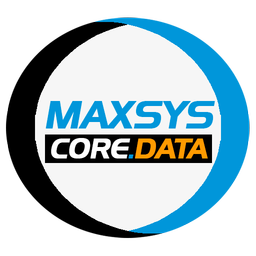

<div align="center">

<h1>Maxsys Core Data</h1>
</div>


**Maxsys.Core.Data** é uma biblioteca em C# para dar suporte à criação de aplicações Maxsys.
Complementa o pacote **Maxsys.Core**, porém voltado ao acesso à dados e se utiliza de *Entity Framework*.


## :package: Nuget


```xml
    <PackageReference Include="Maxsys.Core.Data" Version="15.1.0" />
```

## :link: Dependências


## :star2: Features
As principais *features* do projeto, podem ser vistas [aqui](FEATURES.md).

## :black_nib: Autores
[@MaxDolabella](https://www.github.com/MaxDolabella)

## :monocle_face: Aprendizagem
Através desse projeto, tenho a oportunidade de por em prática parte do conhecimento adquirido. Obviamente, ainda é limitado, mas a intenção é sempre buscar a melhora.

## :old_key: Licença
Este código possui licença MIT e está liberado para uso da maneira que se desejar.
  
## :email: Feedback
Quaisquer sugestões ou outro contato, escreva-me nesse [e-mail](mailto:maxsystech@outlook.com?subject=Github%20contact).

## :new: Release Notes
Os *changelogs* do projeto podem ser vistos [aqui](CHANGELOGS.md)