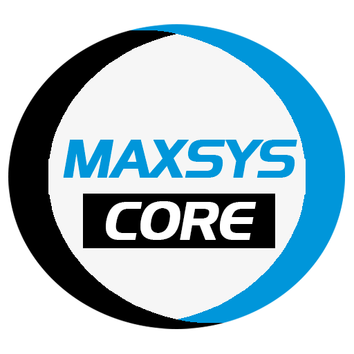

<div align="center">

<h1>Maxsys Core</h1>
</div>

[](LICENSE)

**Maxsys.Core** é uma biblioteca desenvolvida em C# contendo itens básicos para criação de aplicações Maxsys.

Esse pacote contém interfaces e classes bases como `IRepository`, `IService`, e toda uma infraestrutura como filtros, critérios de listagem, além de classes *helpers* e *extensions* como `GuidGen` para gerar Guids sequenciais e `ValidationResultExtensions` que possui métodos de extensão para a classe `FluentValidation.ValidationResult`.

Essa biblioteca auxilia no desenvolvimento de minhas aplicações pessoais `Windows Forms`, `WPF` e `ASP.NET Core (WebAPI, MVC)`.


## :package: Nuget


```xml
    <PackageReference Include="Maxsys.Core" Version="16.0.0" />
```

## :link: Dependências

  
  
  
  
  
  
  
  
  
  
  


## :star2: Features
As principais *features* do projeto podem ser vistas [aqui](FEATURES.md).

## :black_nib: Autores
[@MaxDolabella](https://www.github.com/MaxDolabella)

Aqui uma menção à [Jeremy H. Todd](https://github.com/jhtodd), autor de uma das features usadas nesse projeto (geração de guid sequencial).

## :monocle_face: Aprendizagem
Através desse projeto, tenho a oportunidade de por em prática parte do conhecimento adquirido. Obviamente, ainda é limitado, mas a intenção é sempre buscar a melhora.

## :old_key: Licença
Este código possui licença MIT e está liberado para uso da maneira que se desejar.
  
## :email: Feedback
Quaisquer sugestões ou outro contato, escreva-me nesse [e-mail](mailto:maxsystech@outlook.com?subject=Github%20contact).

## :new: Release Notes
Os *changelogs* do projeto podem ser vistos [aqui](CHANGELOGS.md)

<style>
  .warning { color: DarkGoldenRod; }
  h1 { color: Snow; }
  h2 { color: Crimson; }
  h3 { color: SteelBlue; }
  h4 { color: SeaGreen; }
</style>